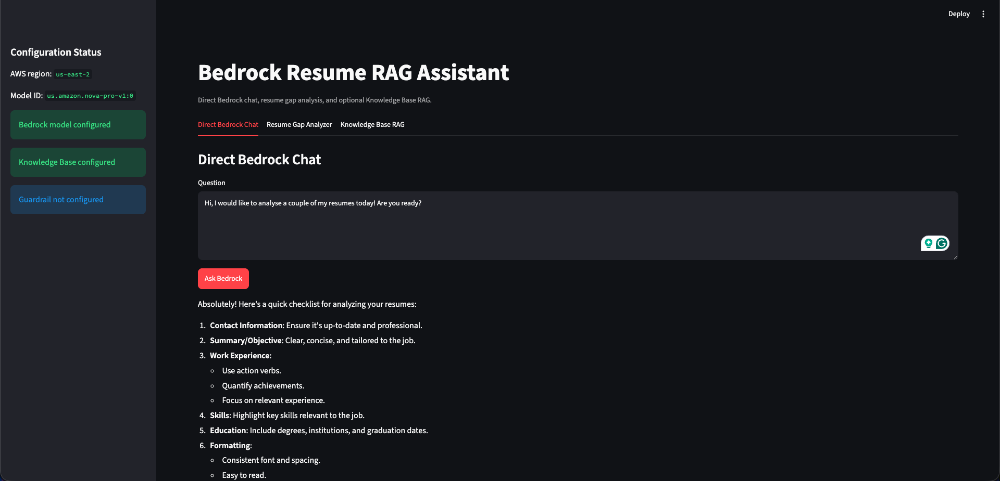
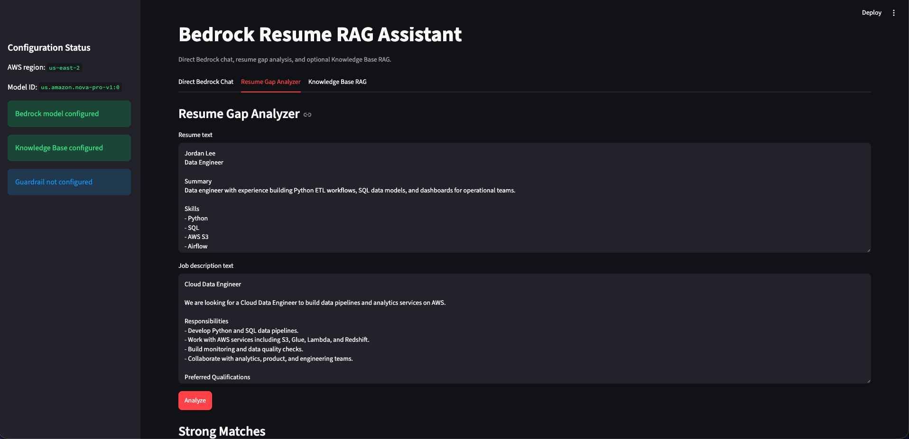
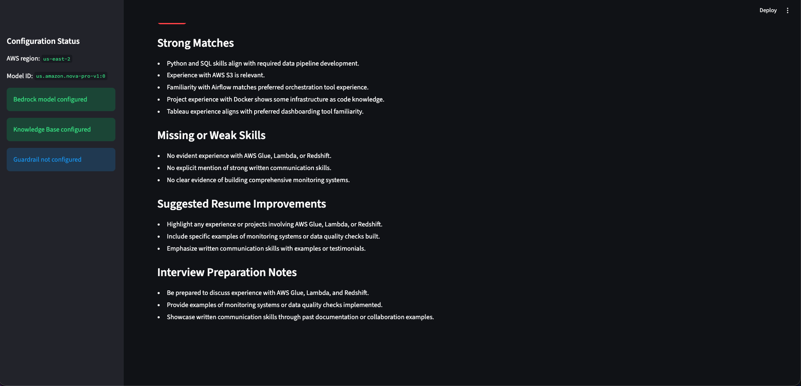

# bedrock-resume-rag-assistant

A small Streamlit project that demonstrates Amazon Bedrock model inference with `boto3`, a resume/job-description gap analyzer with upload-triggered Knowledge Base ingestion, and an optional Amazon Bedrock Knowledge Bases RAG tab.

The app is intentionally minimal. It opens locally even when AWS credentials, a model ID, or a Knowledge Base are not configured. When Bedrock cannot be reached, the UI shows a readable configuration or request error instead of inventing a response.

## Screenshots

### Direct Bedrock Chat



### Resume Gap Analyzer



### Resume Gap Analyzer Results



## Architecture

- `app.py` contains the Streamlit UI.
- `src/config.py` loads settings from environment variables and `.env`.
- `src/bedrock_chat.py` calls the Bedrock Runtime Converse API.
- `src/bedrock_rag.py` uploads analyzer documents to an S3-backed Knowledge Base data source, starts Bedrock Knowledge Base ingestion jobs through Bedrock Agent, and calls Bedrock Agent Runtime `retrieve_and_generate` only when a Knowledge Base ID is configured.
- `src/prompts.py` contains prompt text for the resume analyzer.
- `data/` contains generic sample text files.

## Setup

Create and activate a virtual environment:

```bash
python -m venv .venv
source .venv/bin/activate
```

Install dependencies:

```bash
pip install -r requirements.txt
```

Create a local `.env` file:

```bash
cp .env.example .env
```

Edit `.env` as needed:

```bash
AWS_REGION=us-east-1
BEDROCK_MODEL_ID=amazon.nova-pro-v1:0
BEDROCK_KNOWLEDGE_BASE_ID=
BEDROCK_KNOWLEDGE_BASE_DATA_SOURCE_ID=
BEDROCK_GUARDRAIL_ID=
BEDROCK_GUARDRAIL_VERSION=
```

Do not put AWS access keys in `.env`. Use normal AWS credential configuration, such as AWS CLI profiles, SSO, IAM roles, or environment variables managed outside the repository.

## Run

```bash
streamlit run app.py
```

Then open the local Streamlit URL shown in the terminal.

## AWS Services Used

- Amazon Bedrock Runtime for direct model inference through the Converse API.
- Amazon Bedrock Knowledge Bases through Bedrock Agent for data source ingestion and Bedrock Agent Runtime for optional RAG.

To use direct chat, your AWS identity needs permission to call Bedrock Runtime and access the configured model. To use the Knowledge Base tab, set `BEDROCK_KNOWLEDGE_BASE_ID` and make sure the Knowledge Base already exists in the selected AWS region.

To start an ingestion job from the app, also set `BEDROCK_KNOWLEDGE_BASE_DATA_SOURCE_ID`. Your AWS identity needs permission to call `bedrock:StartIngestionJob` for that Knowledge Base data source.

The Resume Gap Analyzer tab accepts text-like uploads (`.txt`, `.md`, `.csv`, `.json`). When a user uploads a replacement resume or job description, the app replaces the text area content, uploads both analyzer documents to the configured S3-backed Knowledge Base data source under `streamlit-analyzer/`, and starts an ingestion job. The ingestion job runs asynchronously in AWS.

For upload-triggered ingestion, the configured Knowledge Base data source must be S3-backed. Your AWS identity also needs `bedrock:GetDataSource` and `s3:PutObject` access to the data source bucket or prefix.


## Limitations

- No Terraform, CDK, or deployment automation is included.
- The app does not create a Knowledge Base or data source. It uploads analyzer text files only to an existing configured S3 data source and starts ingestion for that data source.
- Guardrail settings are loaded and displayed, but this minimal demo does not attach guardrails to requests.
- Error messages are returned to the UI instead of raising exceptions.
